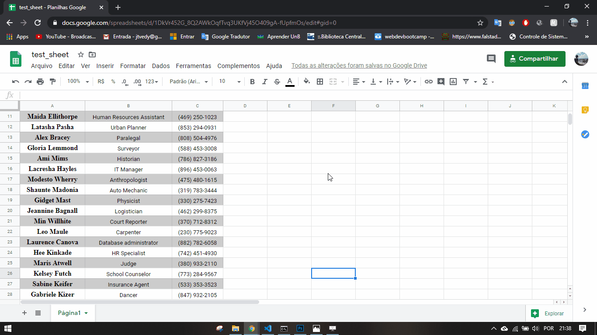

# Signature Automation
Author : Edmundo Ribeiro 

Email : jtvedy@gmail.com / edmundoribeiro@mecajun.com

## What is
This is a program to automate the process of creating the members email signatures every semester
at the junior enterprise [Mecajun](https://www.mecajun.com/). To protect the members personal data and enterprise data this repository do not contain the original code developet there, but instead an exemplifiend vesrsion. 

## Motivation
Every semester someone in the junior enterprise [Mecajun](https://www.mecajun.com/) that i'm member had to create the email signatures, in photoshop, for all new members and members that changed roles. This process was time consuming and when was my time to update the design of the email signature, I decided to automate the process so I wouldnt have to create more than 30 of those by hand in photoshop. Now the processe is relly quick, pratical and no one has to sempt the day creating signatures or be afraid to make some design changes. 

## What it does
The program creates a batch of .jpg images according to the design developed in the .psd (Photoshop) file and with the employee contact information, the employee role, the company contact, the company logo, etc. It gets those informations from an online [Google Drive sheet](https://docs.google.com/spreadsheets).

---

## Dependencies:
- Photoshop
- Python 3
- Libreries
  - [gspread](https://gspread.readthedocs.io/en/latest/)
  - [pandas](https://pandas.pydata.org/)
  - [oauth2client](https://oauth2client.readthedocs.io/en/latest/)
  - [json2.js](https://gist.github.com/atheken/654510)

---

## Overview:

- The credentials.json is a file made aveilable by the google docs [api](https://developers.google.com/drive) and grant access to the drive sheet from the python code.

- The Adobe Photoshop is capable of executing similar to javaScript [scripts](https://www.adobe.com/content/dam/acom/en/devnet/photoshop/scripting/photoshop-cc-scripting-guide.pdf) to manipulate .psd project elements.

- [signature.jsx](/signature.jsx) is the script that will run in the Photoshop.

- [xl2json.py](/xl2json.py) is responseble to get the data from the google sheet and create a .json file with this data.
---

## How to run

### What you will need

- Open the google api [console]() 
  - Create a new project
  - Enable the google drive API
  - Genarate API credentials and download the credentials.json file
  
- Open [Google sheets](https://docs.google.com/spreadsheets)
  - Create a google sheet like this one: [test_sheet](https://docs.google.com/spreadsheets/d/1DkVr452G_8Q2AWkOqfTvq3UKfVj45O409gA-fUpfmOs/edit?usp=sharing)
  - Share it with the email addres obtained in the file credentials.json
  - Allow this email to edit the sheet

- Clone/Download this repository
  - Install all of the python dependencies by running `pip install -r libraries/modules.txt `
  - From the terminal run `python xl2json.py`
  - Open the new file __members.json__ and check if everything is ok

- Now open the .psd file in Photoshop 
  - Go to file > scripts > search and select [signture.jsx](/signture.jsx)
  - Click Ok at the program prompt
  - Wait it finish prossesing 
  - _OBS_: It it possible to change the whole design, but the red marked folders cannot be renamed

- Open the Signatures folder and see the results

## Preview

